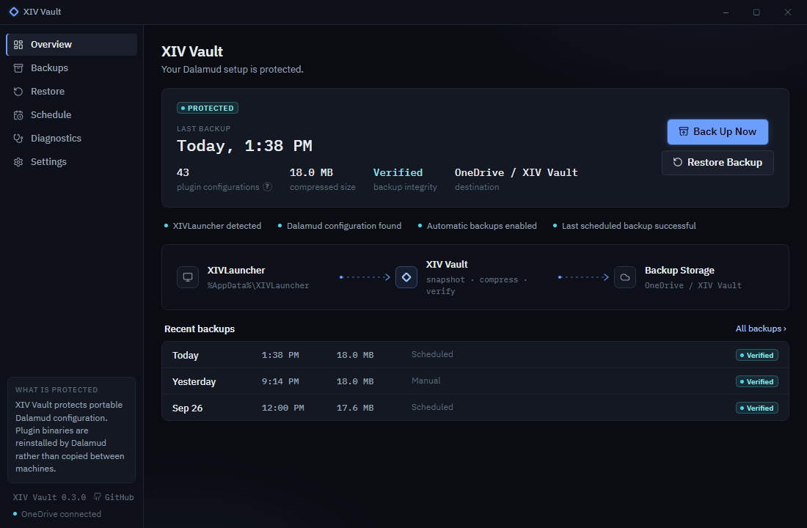
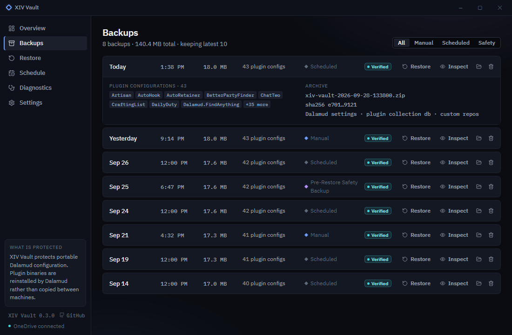
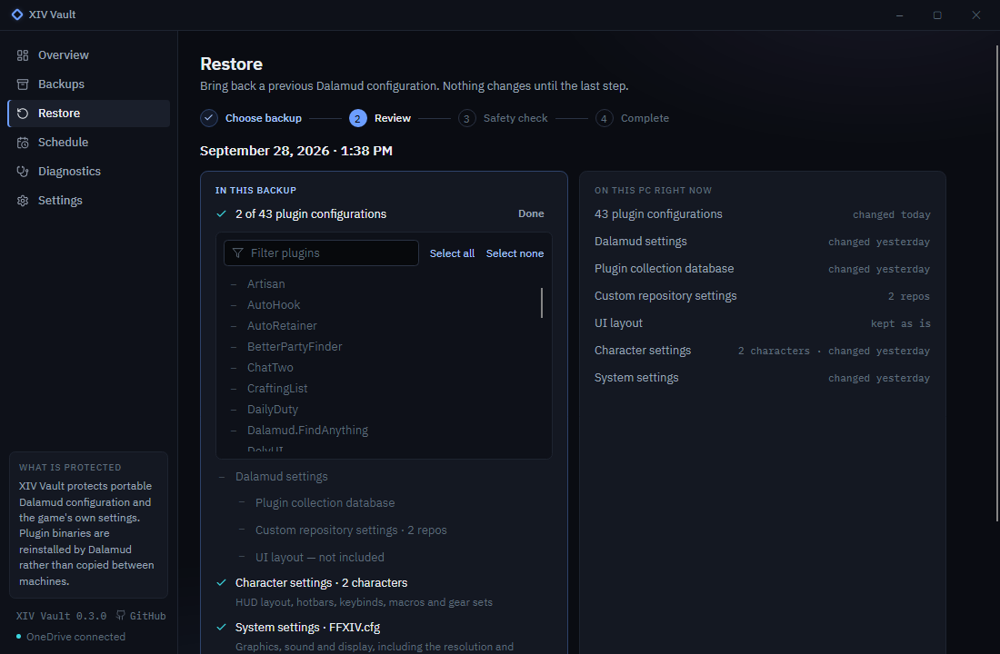
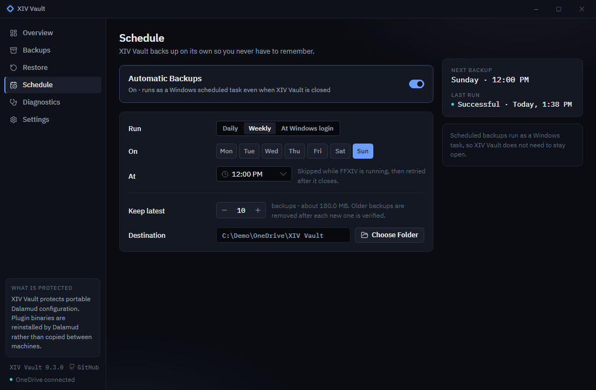
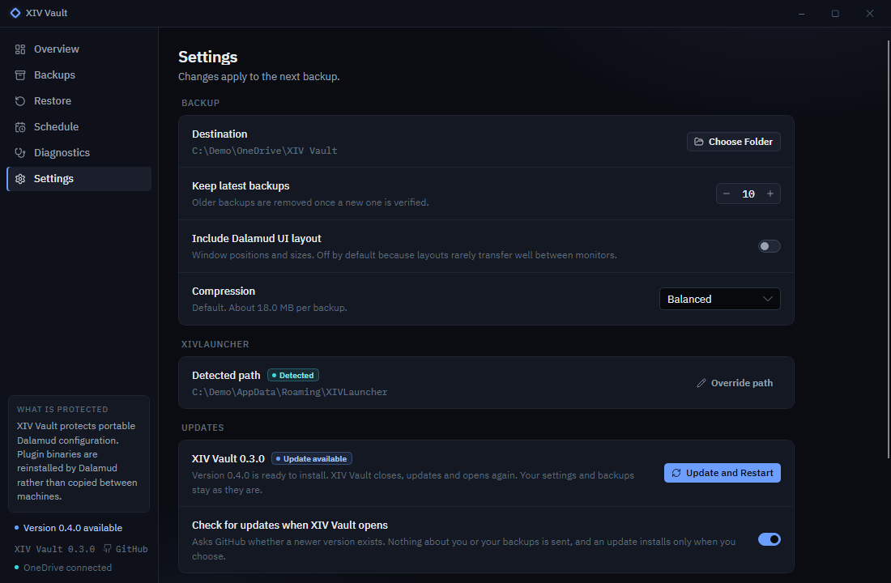

<p align="center"></p>

**Move to a new PC without losing your Dalamud setup.** XIV Vault backs up the portable part of your XIVLauncher / Dalamud configuration (plugin settings, Dalamud settings, the plugin database) and the game's own settings (HUD layout, hotbars, keybinds, macros, gear sets) into a plain ZIP in a folder you choose, such as OneDrive, Dropbox, a NAS or an external drive. On a fresh PC you install XIVLauncher, open XIV Vault and restore.

XIV Vault is a Windows desktop app and a command-line tool built on one engine. Every backup is hash-verified, and every restore takes a safety backup first.



## Install

Download the latest release from [Releases](https://github.com/hazeliscoding/xiv-vault/releases):

- `xiv-vault-setup-win-x64.exe`: installs the app for your Windows user, with no administrator prompt, adds it to the Start menu and keeps it up to date. Uninstall it from Windows Settings → Apps; your settings and backups stay.
- `xiv-vault-desktop-win-x64.zip`: the same app as a portable copy. Unzip it anywhere and run `XIV-Vault.exe`. A portable copy doesn't update itself.
- `xiv-vault-cli-win-x64.zip`: the command line. Unzip `xiv-vault.exe` into a folder on your `PATH`. Keep it out of the app's folder: Windows sees `xiv-vault.exe` and `XIV-Vault.exe` as the same name.

All three are self-contained: no .NET install is needed. Check downloads against `SHA256SUMS` on the release page. Setup and both programs are code-signed, with Hazel Granados as the publisher. While a release is new, Windows SmartScreen may still ask you to confirm Setup, until enough people have downloaded it. The `.nupkg` and `releases.win.json` files on each release are what installed copies download to update.

## Using the app

| | |
|---|---|
| **Overview** | Whether your setup is protected, the last backup, and **Back Up Now**. |
| **Backups** | Every backup with its size, plugin count, type (Manual, Scheduled, Pre-Restore) and integrity. Inspect, restore, show in Explorer or delete. |
| **Restore** | A four-step wizard: choose a backup, review what changes, run safety checks, restore. In the review you can restore just some plugins, or leave Dalamud settings, character settings or system settings as they are. Nothing on disk changes before the last step. |
| **Schedule** | Automatic backups through Windows Task Scheduler: daily, weekly or at Windows login. |
| **Diagnostics** | Checks for XIVLauncher, Dalamud, the backup folder, scheduling and game settings, plus a report you can paste into an issue. |
| **Settings** | Backup folder, how many backups to keep, the UI layout and game settings options, compression, and the XIVLauncher folder. |





## Moving to a new PC

1. On the new PC, install XIVLauncher and start it once.
2. Make your backups available: sign in to OneDrive or Dropbox, or plug in the drive. Backups that stay in the cloud are fine: XIV Vault lists them without downloading them.
3. Install XIV Vault with Setup and open it. If the backups are in `OneDrive\XIV Vault`, XIV Vault finds them on its own. Otherwise choose the folder in **Settings**, or pick a backup file in the restore wizard.
4. Open **Restore**, choose the newest backup, review it, and let the safety checks run. XIVLauncher and FFXIV must be closed. A backup that is still in the cloud downloads first, and XIV Vault shows its size before it starts.
5. Select **Restore Configuration**, then open XIVLauncher. Dalamud downloads your plugins again and they pick up their restored settings, and the game finds your HUD layout, hotbars and macros when you log in. The game doesn't need to have started on the new PC first.

System settings hold the resolution and monitor. If the new PC has a different screen, leave **System settings** out in the review and set graphics again in the game.

## Command line

```powershell
xiv-vault backup                        # back up now
xiv-vault backup --quiet                # print nothing unless it fails
xiv-vault backup --destination D:\Backups
xiv-vault list                          # backups in the backup folder; --verify checks every one
xiv-vault status                        # is the setup protected?
xiv-vault status --json
xiv-vault doctor                        # health checks; --report for a shareable copy
xiv-vault restore                       # choose from a list
xiv-vault restore latest                # asks before it changes anything; --yes for scripts
xiv-vault restore latest --plugin Artisan   # only that plugin; repeat --plugin, add --dalamud-settings
xiv-vault restore latest --character-settings   # only the game's character settings; add --system-settings for FFXIV.cfg
xiv-vault schedule weekly --day Sunday --time 18:30
xiv-vault schedule status
xiv-vault schedule remove
xiv-vault config                        # show settings; config set <key> <value> to change one
xiv-vault version
```

`config set` takes `destination`, `retention`, `include-ui`, `include-game` (the game's own settings, on by default), `compression` (`fast`, `balanced`, `maximum`) and `source` (the XIVLauncher folder, or `auto`). Add `--verbose` to any command to see each step.

Exit codes are stable, so scripts can rely on them:

| Code | Meaning |
|---|---|
| 0 | Success |
| 1 | Unexpected failure |
| 2 | Invalid arguments or configuration |
| 3 | XIVLauncher not found |
| 4 | Backup validation failure |
| 5 | Restore validation failure |
| 6 | XIVLauncher or FFXIV is running |
| 7 | Backup folder unavailable |

## Scheduling

Turning on automatic backups creates one Windows scheduled task, **XIV Vault Scheduled Backup**, that runs as you with normal permissions. XIV Vault doesn't need to stay open, and there is no background service. If the PC was off at the scheduled time, the backup runs when it next starts. If FFXIV is running, the backup waits for the game to close (up to 6 hours) instead of copying files the game has open.

The task runs the program that set it up: `XIV-Vault.exe --scheduled-backup` (no window) or `xiv-vault backup --scheduled`. Updates keep the installed app in the same place, so the task keeps working, and uninstalling XIV Vault removes it. If you move a portable copy to another folder, set the schedule again; **Diagnostics** warns when the task points to a missing program.



## Updates

An installed copy asks GitHub for the latest release each time it opens. When a newer version exists, the sidebar says so, and **Settings → Updates → Update and Restart** downloads it, closes XIV Vault, installs it and opens it again. Nothing installs until you choose it, and your settings and backups are not touched.

An update waits while a backup or restore runs, or while a scheduled backup or another XIV Vault window is open, because installing closes every running copy. To update by hand instead, turn off **Check for updates when XIV Vault opens** in **Settings**.



## Where to keep backups

A backup is only as safe as the place it lives. Good choices:

- A folder synced by **OneDrive**, **Dropbox** or Google Drive. XIV Vault uses `%OneDrive%\XIV Vault` by default when OneDrive is set up. When backups are kept online only (OneDrive Files On-Demand), XIV Vault lists them without downloading them and downloads only the one you restore.
- A **NAS** or network share.
- An **external drive**, if you remember to plug it in.

A folder on the same drive as XIVLauncher protects against mistakes, but not against that drive failing. **Diagnostics** points this out. XIV Vault never talks to cloud services itself: it writes files, and your sync client does the rest.

## What is backed up

From the XIVLauncher folder (`%AppData%\XIVLauncher`, or its `dalamudUserData` folder when that is where Dalamud keeps its files):

| Item | What it is |
|---|---|
| `pluginConfigs\` | Every plugin's settings, including plugins' own subfolders |
| `dalamudConfig.json` | Dalamud's settings, including your custom plugin repositories |
| `dalamudVfs.db` | Dalamud's plugin database |
| `dalamudUI.ini` | Window positions and sizes. Off by default, because layouts rarely transfer well between monitors |

Inside `pluginConfigs\`, temporary files and `logs`/`cache` folders are skipped, and links are not followed.

From the game's settings folder (`Documents\My Games\FINAL FANTASY XIV - A Realm Reborn`):

| Item | What it is |
|---|---|
| `FFXIV_CHR…\*.DAT` | Character settings, for each character: HUD layout, hotbars, keybinds, macros, gear sets, log filters and more |
| `MACROSYS.dat` | Shared macros |
| `FFXIV_CHARA_*.dat` | Appearance saves from character creation and the aesthetician |
| `FFXIV.cfg` | System settings: graphics, sound, display and more, including the resolution and monitor |

The files are copied byte for byte; XIV Vault never looks inside them. Each character's folder is named by a content ID that identifies the character, so XIV Vault counts characters and never shows or logs the ID. Turn game settings off in **Settings**, or with `xiv-vault config set include-game no`; safety backups hold them either way.

## What is not backed up

- **Plugin binaries** (`installedPlugins\`). XIV Vault does not copy or install plugins. Dalamud downloads them again on the new PC.
- Dalamud's runtime and hooks (`runtime\`, `addon\`), logs, caches and anything downloaded.
- XIVLauncher's own settings and the game install.
- From the game's settings folder: chat logs, screenshots, `cfgcopy`, `*.old` copies and `FFXIV_BOOT.cfg`.

## Safety model

- **Allowlist.** XIV Vault reads and writes only the items above. It never archives the whole XIVLauncher folder or the game's settings folder.
- **Verified backups.** Each archive is written as `*.zip.tmp`, read back, and checked against the SHA-256 of every file before it is renamed. A failed backup never looks like a finished one, and old backups are only removed after a new one is verified. XIV Vault also checks the latest backup when it opens, and the backup being restored; `xiv-vault list --verify` checks them all.
- **Guarded restores.** Before anything changes, XIV Vault checks the manifest and every hash, refuses while XIVLauncher or FFXIV runs (the game rewrites its settings when you log out), and takes a **pre-restore safety backup** (the newest 3 are kept). The safety backup holds everything a full restore would replace, even when you restore only some plugins or settings. Each character's settings go back to the folder with the same name, never to another character. The archive is unpacked into a temporary folder and checked again, never extracted over XIVLauncher. Files the backup doesn't contain are never deleted. If a restore fails part-way, every file it changed is put back, in both folders.
- **Hostile archives are refused:** paths with `..`, absolute or drive paths, files outside the allowlist, files the manifest doesn't list, manifests that misdescribe their files, and checksum mismatches.
- **No links.** Backups don't follow links (junctions or symlinks) inside the XIVLauncher folder or the game's settings folder, and restores refuse to write through them.
- **One operation at a time.** A scheduled backup and the app never write to the backup folder at the same time.
- **Nothing is executed** from a backup, and **nothing about you leaves your PC**: no accounts, no telemetry. The only network call is the installed app's update check, which reads the public release list from GitHub, sends nothing about you or your backups, and can be turned off in **Settings**.
- **Logs and diagnostic reports** hold paths, counts and results, never configuration contents, and never a character's content ID.

The archive format is documented in [docs/backup-format.md](docs/backup-format.md). Backups open in any ZIP tool.

## Limitations

- Windows only.
- Plugins are reinstalled by Dalamud on the new PC; XIV Vault restores their settings, not the plugins.
- Some plugins keep data outside `pluginConfigs\`; that data is not included.
- Restoring replaces settings for the plugins in the backup. Plugins configured after the backup return to their earlier settings; the restore review lists them, and the safety backup keeps today's values.
- A new release's Setup may get a SmartScreen warning until it has been downloaded enough to build a reputation.

## Troubleshooting

See [docs/troubleshooting.md](docs/troubleshooting.md). Start with **Diagnostics** (or `xiv-vault doctor`), and attach its report to any issue.

## Building from source

```powershell
dotnet build
dotnet test
dotnet run --project src/XivVault.Desktop
dotnet run --project src/XivVault.Cli -- status
./scripts/smoke-test.ps1 -Cli src/XivVault.Cli/bin/Debug/net10.0/xiv-vault.dll
```

Requires the .NET 10 SDK. [docs/architecture.md](docs/architecture.md) explains how the code fits together, and [ROADMAP.md](ROADMAP.md) records what is planned and the decisions behind it.

## License

[Apache-2.0](LICENSE). Bundled fonts and icons are listed in [THIRD-PARTY-NOTICES.md](THIRD-PARTY-NOTICES.md). XIV Vault is not affiliated with Square Enix, XIVLauncher or Dalamud.
