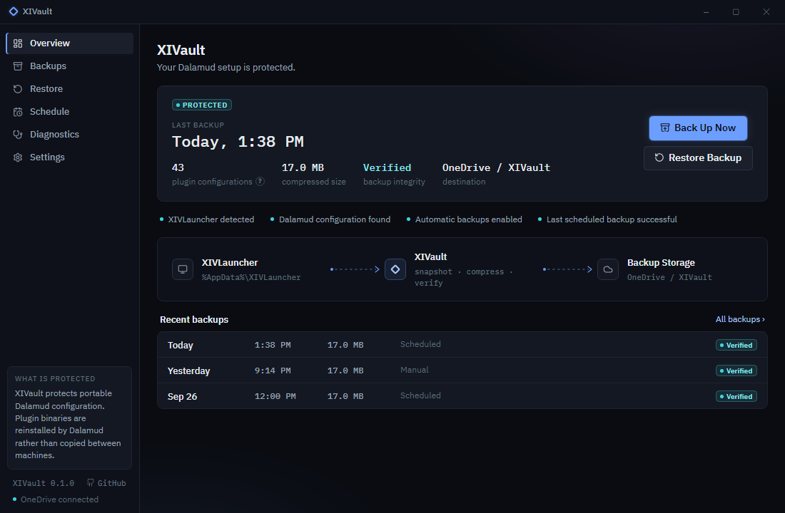
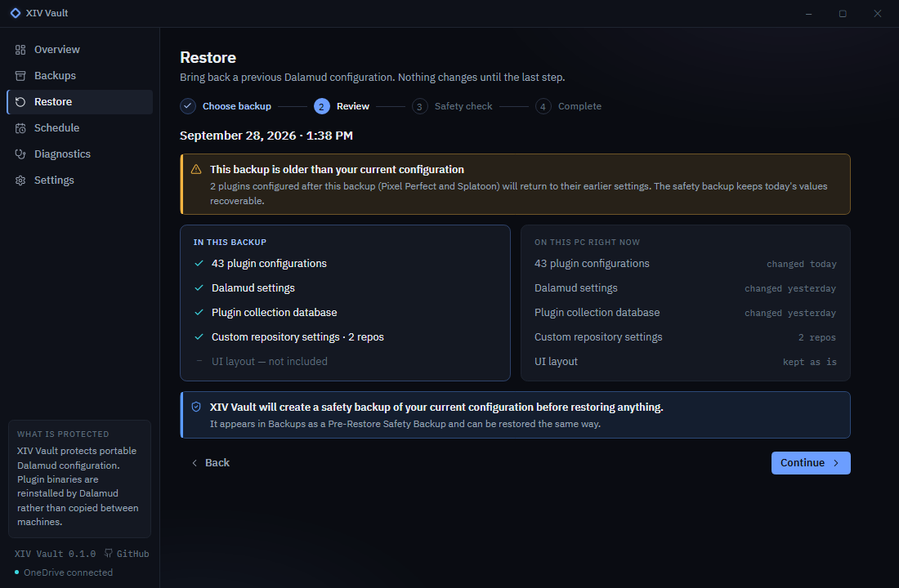

<p align="center"></p>

**Move to a new PC without losing your Dalamud setup.** XIV Vault backs up the portable part of your XIVLauncher / Dalamud configuration (plugin settings, Dalamud settings, the plugin database) into a plain ZIP in a folder you choose, such as OneDrive, Dropbox, a NAS or an external drive. On a fresh PC you install XIVLauncher, open XIV Vault and restore.

XIV Vault is a Windows desktop app and a command-line tool built on one engine. Every backup is hash-verified, and every restore takes a safety backup first.



## Install

Download the latest release from [Releases](https://github.com/hazeliscoding/xiv-vault/releases):

- `XIVault.Desktop-win-x64.zip`: the app. Unzip it anywhere, for example `%LOCALAPPDATA%\Programs\XIVault`, and run `XIVault.Desktop.exe`.
- `xivault-cli-win-x64.zip`: the command line. Unzip `xivault.exe` into a folder on your `PATH`.

Both are self-contained: no .NET install is needed. Check downloads against `SHA256SUMS` on the release page. The builds are not code-signed yet, so Windows SmartScreen may ask you to confirm the first run.

## Using the app

| | |
|---|---|
| **Overview** | Whether your setup is protected, the last backup, and **Back Up Now**. |
| **Backups** | Every backup with its size, plugin count, type (Manual, Scheduled, Pre-Restore) and integrity. Inspect, restore, show in Explorer or delete. |
| **Restore** | A four-step wizard: choose a backup, review what changes, run safety checks, restore. Nothing on disk changes before the last step. |
| **Schedule** | Automatic backups through Windows Task Scheduler: daily, weekly or at Windows login. |
| **Diagnostics** | Checks for XIVLauncher, Dalamud, the backup folder and scheduling, plus a report you can paste into an issue. |
| **Settings** | Backup folder, how many backups to keep, the UI layout option, compression, and the XIVLauncher folder. |




## Moving to a new PC

1. On the new PC, install XIVLauncher and start it once.
2. Make your backups available: let OneDrive or Dropbox finish syncing, or plug in the drive.
3. Install XIV Vault and open it. If the backups are in `OneDrive\XIVault`, XIV Vault finds them on its own. Otherwise choose the folder in **Settings**, or pick a backup file in the restore wizard.
4. Open **Restore**, choose the newest backup, review it, and let the safety checks run. XIVLauncher and FFXIV must be closed.
5. Select **Restore Configuration**, then open XIVLauncher. Dalamud downloads your plugins again and they pick up their restored settings.

## Command line

```powershell
xivault backup                        # back up now
xivault backup --quiet                # print nothing unless it fails
xivault backup --destination D:\XIVault
xivault list                          # backups in the backup folder
xivault status                        # is the setup protected?
xivault status --json
xivault doctor                        # health checks; --report for a shareable copy
xivault restore                       # choose from a list
xivault restore latest                # asks before it changes anything; --yes for scripts
xivault schedule weekly --day Sunday --time 18:30
xivault schedule status
xivault schedule remove
xivault config                        # show settings; config set <key> <value> to change one
xivault version
```

`config set` takes `destination`, `retention`, `include-ui`, `compression` (`fast`, `balanced`, `maximum`) and `source` (the XIVLauncher folder, or `auto`). Add `--verbose` to any command to see each step.

Exit codes are stable, so scripts can rely on them:

| Code | Meaning |
|---|---|
| 0 | Success |
| 1 | Unexpected failure |
| 2 | Invalid arguments or configuration |
| 3 | XIVLauncher not found |
| 4 | Backup validation failure |
| 5 | Restore validation failure |
| 6 | XIVLauncher or FFXIV is running |
| 7 | Backup folder unavailable |

## Scheduling

Turning on automatic backups creates one Windows scheduled task, **XIV Vault Scheduled Backup**, that runs as you with normal permissions. XIV Vault doesn't need to stay open, and there is no background service. If the PC was off at the scheduled time, the backup runs when it next starts. If FFXIV is running, the backup waits for the game to close (up to 6 hours) instead of copying files the game has open.

The task runs the program that set it up: `XIVault.Desktop.exe --scheduled-backup` (no window) or `xivault backup --scheduled`. If you move XIV Vault to another folder, set the schedule again; **Diagnostics** warns when the task points to a missing program.


## Where to keep backups

A backup is only as safe as the place it lives. Good choices:

- A folder synced by **OneDrive**, **Dropbox** or Google Drive. XIV Vault uses `%OneDrive%\XIVault` by default when OneDrive is set up.
- A **NAS** or network share.
- An **external drive**, if you remember to plug it in.

A folder on the same drive as XIVLauncher protects against mistakes, but not against that drive failing. **Diagnostics** points this out. XIV Vault never talks to cloud services itself: it writes files, and your sync client does the rest.

## What is backed up

From the XIVLauncher folder (`%AppData%\XIVLauncher`, or its `dalamudUserData` folder when that is where Dalamud keeps its files):

| Item | What it is |
|---|---|
| `pluginConfigs\` | Every plugin's settings, including plugins' own subfolders |
| `dalamudConfig.json` | Dalamud's settings, including your custom plugin repositories |
| `dalamudVfs.db` | Dalamud's plugin database |
| `dalamudUI.ini` | Window positions and sizes. Off by default, because layouts rarely transfer well between monitors |

Inside `pluginConfigs\`, temporary files and `logs`/`cache` folders are skipped, and links are not followed.

## What is not backed up

- **Plugin binaries** (`installedPlugins\`). XIV Vault does not copy or install plugins. Dalamud downloads them again on the new PC.
- Dalamud's runtime and hooks (`runtime\`, `addon\`), logs, caches and anything downloaded.
- XIVLauncher's own settings and your game files.

## Safety model

- **Allowlist.** XIV Vault reads and writes only the items above. It never archives the whole XIVLauncher folder.
- **Verified backups.** Each archive is written as `*.zip.tmp`, read back, and checked against the SHA-256 of every file before it is renamed. A failed backup never looks like a finished one, and old backups are only removed after a new one is verified.
- **Guarded restores.** Before anything changes, XIV Vault checks the manifest and every hash, refuses while XIVLauncher or FFXIV runs, and takes a **pre-restore safety backup** (the newest 3 are kept). The archive is unpacked into a temporary folder and checked again, never extracted over XIVLauncher. Files the backup doesn't contain are never deleted. If a restore fails part-way, every file it changed is put back.
- **Hostile archives are refused:** paths with `..`, absolute or drive paths, files outside the allowlist, files the manifest doesn't list, manifests that misdescribe their files, and checksum mismatches.
- **No links.** Backups don't follow links (junctions or symlinks) inside the XIVLauncher folder, and restores refuse to write through them.
- **One operation at a time.** A scheduled backup and the app never write to the backup folder at the same time.
- **Nothing is executed** from a backup, and **nothing leaves your PC**: no accounts, no telemetry, no network calls.
- **Logs and diagnostic reports** hold paths, counts and results, never configuration contents.

The archive format is documented in [docs/backup-format.md](docs/backup-format.md). Backups open in any ZIP tool.

## Limitations

- Windows only.
- Plugins are reinstalled by Dalamud on the new PC; XIV Vault restores their settings, not the plugins.
- Some plugins keep data outside `pluginConfigs\`; that data is not included.
- Restoring replaces settings for the plugins in the backup. Plugins configured after the backup return to their earlier settings; the restore review lists them, and the safety backup keeps today's values.
- Builds are not code-signed yet.

## Troubleshooting

See [docs/troubleshooting.md](docs/troubleshooting.md). Start with **Diagnostics** (or `xivault doctor`), and attach its report to any issue.

## Building from source

```powershell
dotnet build
dotnet test
dotnet run --project src/XIVault.Desktop
dotnet run --project src/XIVault.Cli -- status
./scripts/smoke-test.ps1 -Cli src/XIVault.Cli/bin/Debug/net10.0/xivault.dll
```

Requires the .NET 10 SDK. [docs/architecture.md](docs/architecture.md) explains how the code fits together, and [ROADMAP.md](ROADMAP.md) records what is planned and the decisions behind it.

## License

[Apache-2.0](LICENSE). Bundled fonts and icons are listed in [THIRD-PARTY-NOTICES.md](THIRD-PARTY-NOTICES.md). XIV Vault is not affiliated with Square Enix, XIVLauncher or Dalamud.
